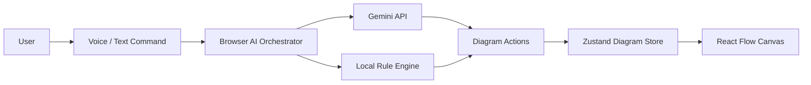

# Phase 1: Prototype Audit & Core Assumptions

Source: https://app.notion.com/p/3f039e268b9c8180a75bf44fa9387eb7?pvs=204
Snapshot retrieved: 2026-10-05. Authoritative source last edited: 2026-10-05T07:44:00.700Z.
Portable Markdown conversion; Notion callouts/tables normalized. Code snippets remain illustrative.

**Purpose:** Capture the production-readiness assumptions and architectural guardrails agreed in Phase 1. This page is intended to be reusable as implementation context for Codex later.
## 1. Product Domain
**Tinker is an interactive architecture modeling system where natural-language intent is translated into deterministic graph mutations, with AI acting as an interpreter and architecture advisor.**
### Core principle
> **AI interprets intent. Tinker owns and mutates the diagram state.**
The diagram is the source of truth. Conversation history helps resolve intent but must never be required to reconstruct the architecture.
### Current domain areas
- **Diagram Domain** — nodes, edges, selections, highlights, layout and undo history.
- **Natural Language Command Domain** — converts voice/text into structured actions such as `addNode`, `connect`, `removeNode`, `insertBetween`, `renameNode`, `highlight` and `reset`.
- **Conversation Domain** — stores recent user/assistant turns to provide context to AI.
- **Architecture Intelligence Domain** — explanations, blast-radius reasoning, architecture recommendations and failure analysis.
---
## 2. What the Prototype Currently Looks Like

### Current prototype assumptions
- React + TypeScript + Vite frontend.
- React Flow renders the diagram.
- Zustand holds diagram and conversation state.
- Gemini is called directly from the browser.
- Gemini/API configuration can live in browser-accessible storage/config.
- No application database.
- No authentication.
- No authorization.
- No server-side source of truth.
- No durable revision history.
- No concurrency model.
- No rate limiting, audit trail or production observability.
---
## 3. Top Production Problems
### Problem 1: No durable source of truth
**Current:** Diagram and conversation state live in browser memory.
**Why this breaks:** Refreshes, crashes, device changes and concurrent sessions can lose or diverge user state.
**Production requirement:** Persist authoritative diagram state server-side.
### Problem 2: Browser owns AI credentials and provider calls
**Current:** Browser code directly calls Gemini and can access API configuration.
**Why this breaks:** Credentials, quotas, cost controls, rate limits and provider failures cannot be safely controlled centrally.
**Production requirement:** Route AI requests through a server-owned AI gateway.
### Problem 3: UI state, domain rules and AI orchestration are coupled
**Current:** Graph mutation logic, React Flow state, layout, undo and AI execution are mixed into frontend stores/orchestrator code.
**Why this breaks:** The same business rules will eventually need to exist in backend APIs, autosave, revision history and collaboration logic.
**Production requirement:** Extract a framework-independent diagram domain layer.
---
## 4. Important Secondary Debts
| Area | Prototype State | Production Direction |
| --- | --- | --- |
| Authentication | None | Managed identity provider |
| Authorization | None | Application-owned workspace/diagram permissions |
| Persistence | None | Durable relational persistence |
| IDs | Frontend-generated / human-derived | Stable opaque IDs |
| Concurrency | None | Version-aware writes |
| Idempotency | None | Required for critical mutations |
| Validation | Mostly implicit | Explicit domain validation |
| Rate Limiting | None | Server-side per-user / per-tenant limits |
| Audit Trail | None | Record meaningful mutations and actor |
| Observability | Browser console | Structured logs + metrics + tracing |
| Tests | No visible production test baseline | Domain, API and integration tests |
| Provider Boundary | Gemini-specific | Provider abstraction behind AI gateway |
---
## 5. Domain Modeling Guardrail
**Do not let React Flow become the database schema.**
Separate semantic architecture state from canvas/UI state.
### Domain node
```plain text
id
name
kind
technology
metadata
```
### Canvas node
```plain text
nodeId
x
y
width
height
collapsed
visualStyle
```
**Reason:** Product semantics must survive even if the rendering library changes later.
---
## 6. AI Trust Boundary
Gemini should be treated as an **untrusted command producer**.
### Required mutation path
```plain text
LLM suggestion
→ schema validation
→ authentication
→ authorization
→ domain validation
→ idempotency/version check
→ mutation
→ persistence
```
### Deterministic responsibilities
- Graph mutation.
- Graph traversal.
- Dependency calculations.
- Structural validation.
- Authorization checks.
### Probabilistic responsibilities
- Natural-language interpretation.
- Architecture explanation.
- Recommendations.
- Human-friendly reasoning.
**Rule:** AI may propose `removeNode(id)`; only the application decides whether that command is valid and allowed.
---
## 7. Non-Functional Requirements
### Scale assumption
- Pragmatic MVP for a few thousand active users.
- Do not design for 1M+ users yet.
- Prefer simple horizontally scalable components over microservices.
### Availability
- **Core application target:** 99.9% monthly availability.
- AI must be a degradable dependency.
- Manual diagram editing and saved diagrams should remain available if Gemini is down.
### Consistency
- **Strong consistency:** ownership, permissions, graph mutations, diagram revisions.
- **Eventual consistency:** analytics, derived summaries, search indexes and non-critical caches.
### Latency targets
| Operation | Target |
| --- | --- |
| Normal API read/write | p95 &lt; 300 ms |
| Diagram load | p95 &lt; 500 ms |
| Graph mutation save | p95 &lt; 300 ms |
| Auth validation | p95 &lt; 150 ms |
| AI request accepted | &lt; 300 ms |
| AI first useful result | p95 &lt; 4 s |
| AI hard timeout | 15 s |
| Local editor interaction | Perceived &lt; 100 ms |
### Recovery
- **RPO:** ≤ 5 minutes.
- **RTO:** ≤ 60 minutes.
- Single-region managed infrastructure is acceptable for MVP.
### Durability
Once a save is acknowledged, it must survive application restarts and compute-instance loss.
---
## 8. Phase 1 Architectural Decisions
### Decision 1: Server-side source of truth
**\[Server-side source of truth\] -\> Diagrams survive refreshes, devices and crashes and gain sane concurrency semantics, but every durable mutation now needs a backend contract.**
Use Zustand as fast client/editor state, not canonical persistence.
### Decision 2: Server-mediated AI access
**\[Server-mediated AI access\] -\> Gives us credential protection, quotas, cost controls and observability, at the price of operating the AI proxy path ourselves.**
Target flow:
```plain text
Browser → Tinker API → AI Gateway → Gemini
```
### Decision 3: Cloud-first with local draft recovery
**\[Cloud-first with local draft recovery\] -\> Gives dependable persistence without forcing us to solve distributed offline merge conflicts in the MVP, but true offline editing remains limited.**
Avoid a full local-first synchronization engine for now.
### Decision 4: Snapshot persistence, not full event sourcing
**\[Snapshot persistence with bounded revisions\] -\> Makes reads and saves straightforward while preserving useful history, but gives up perfect replayability.**
Store current diagram state plus bounded revision/change metadata.
### Decision 5: Deterministic graph truth
**\[Keep graph truth deterministic and use AI for interpretation\] -\> Hallucinated model output cannot directly corrupt architecture state, but explicit domain operations must be implemented and validated.**
### Decision 6: Managed authentication
**\[Managed authentication + application-owned authorization\] -\> Removes password/session security burden while retaining control over Tinker permissions, at the cost of a provider dependency.**
Authentication provider selection happens later; authorization stays inside Tinker.
---
## 9. What We Keep, Extract and Replace
### Keep
- React UI.
- React Flow rendering.
- Dagre/layout work.
- Voice interaction UX.
- Gemini function-calling concept.
- Existing diagram command vocabulary.
- Local fallback concept.
### Extract
- Graph mutation rules.
- Graph validation.
- Architecture semantics.
- AI orchestration boundaries.
### Replace
- Browser-owned secrets.
- Memory-only persistence.
- Browser-only source of truth.
- Direct Gemini access.
- Implicit/no identity model.
---
## 10. Command Vocabulary to Preserve
The current command model is useful and should become the production domain command surface.
```plain text
add
connect
disconnect
insert
remove
rename
highlight
explain
```
These commands should eventually be validated independently of React, Zustand and Gemini.
---
## 11. Build Constraints
Use these as implementation guardrails when coding the production version.
- [ ] Do not call Gemini directly from browser code.
- [ ] Do not expose provider secrets through `VITE_*` configuration.
- [ ] Do not make Zustand the canonical persistence layer.
- [ ] Do not let React Flow types define domain persistence types.
- [ ] Keep graph mutation logic framework-independent.
- [ ] Validate every AI-generated command before execution.
- [ ] Add authentication before exposing persistent user diagrams.
- [ ] Check authorization on every diagram read/write.
- [ ] Use opaque stable IDs for persisted entities.
- [ ] Add optimistic concurrency/version checks for diagram writes.
- [ ] Make critical mutations idempotent where retries are possible.
- [ ] Treat AI failure separately from core application failure.
- [ ] Persist acknowledged saves before returning success.
- [ ] Keep the architecture deployable as a simple MVP; avoid premature microservices.
---
## 12. Phase 2: Starting Hypothesis
Do not treat this as final until Phase 2 review.
**Candidate direction:** modular monolith + relational database + managed authentication + server-side AI gateway + lightweight async worker path only where justified.
The next phase should compare this against service decomposition before locking the HLD.

