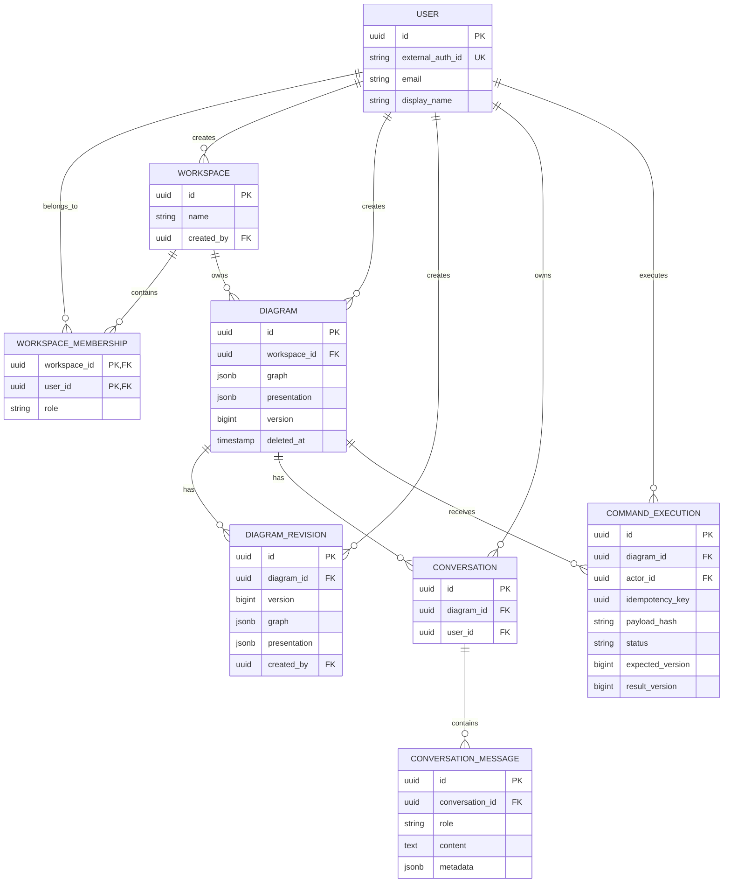
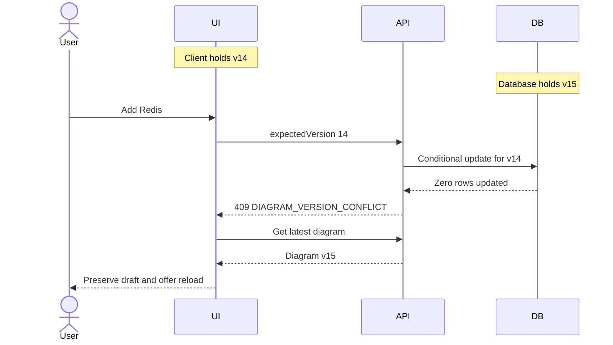
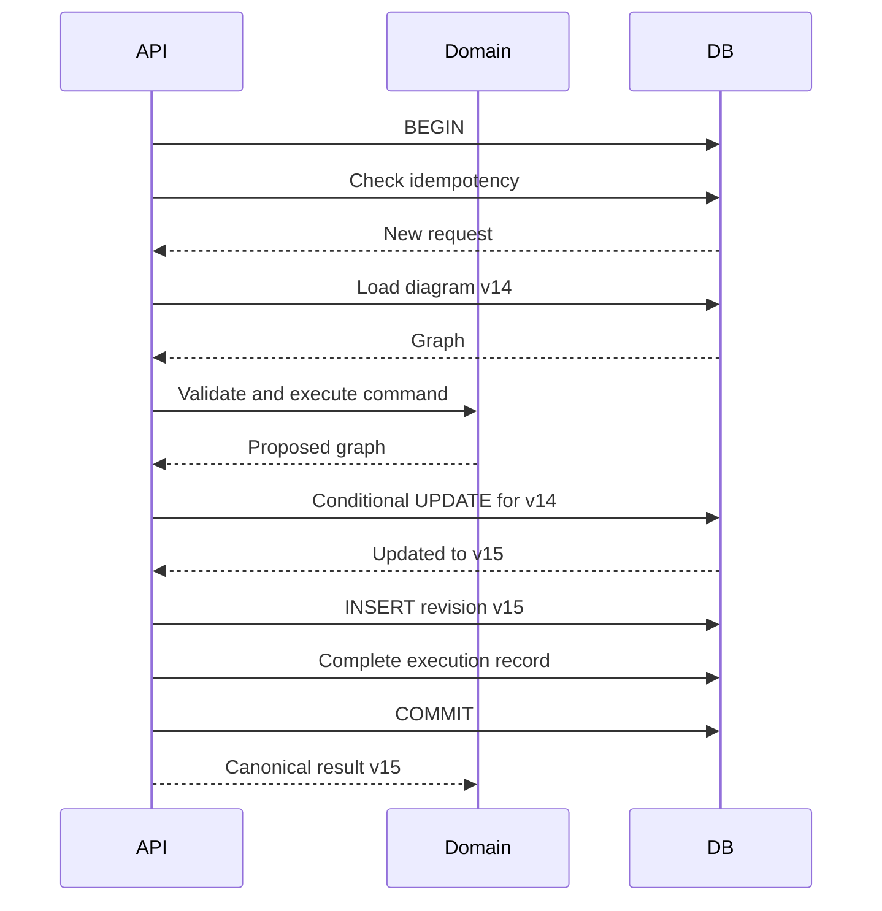
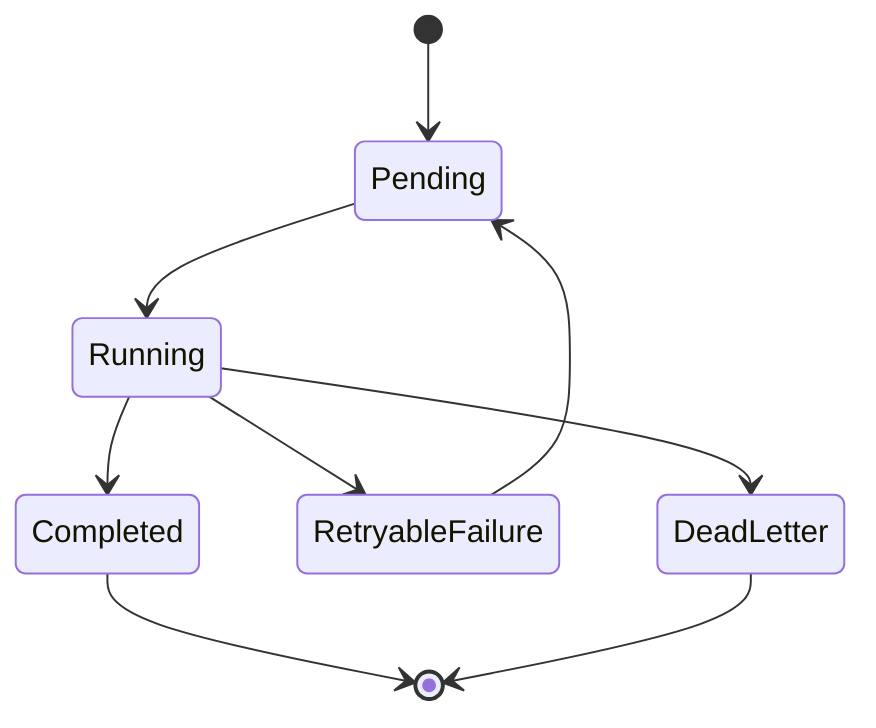
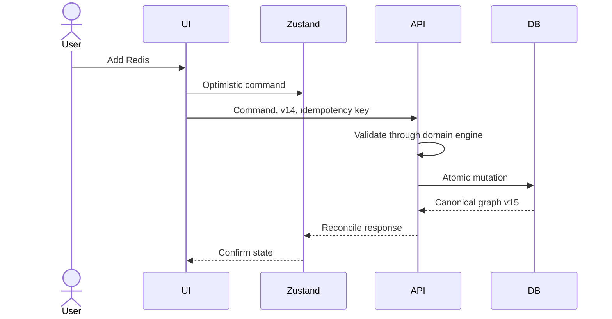
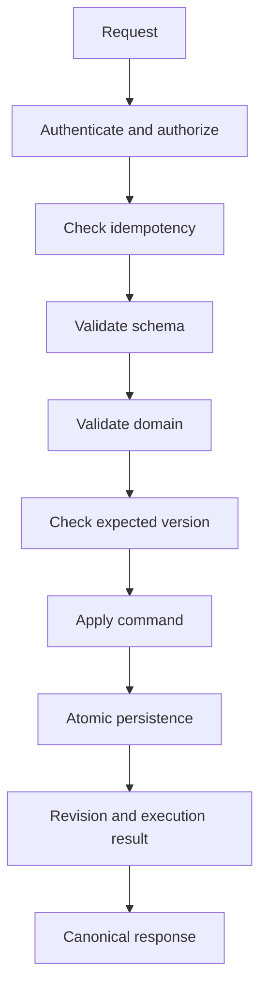

# Phase 3: Low-Level Design (LLD)

Source: https://app.notion.com/p/3f039e268b9c81919df6e1eb7b81255e?pvs=204
Snapshot retrieved: 2026-10-05. Authoritative source last edited: 2026-10-05T08:52:22.971Z.
Portable Markdown conversion; Notion callouts/tables normalized. Code snippets remain illustrative.

**Phase 3 goal:** Turn the Phase 2 architecture into buildable persistence models, command contracts, APIs, concurrency rules, and worker mechanics.
[Related Notion page](https://app.notion.com/p/3f039e268b9c813aa457ee04505783e4)
Captured from the agreed Phase 3 design on 5 October 2026. The five corresponding Miro frames cover the data model, mutation transaction, API/command pipeline, conflict/idempotency flow, and worker lifecycle. The board URL was not supplied in the conversation.

## 1. Core implementation principles
> **Every manual, typed-AI, or voice mutation eventually becomes the same validated DiagramCommand.**
1. PostgreSQL is the durable source of truth.
2. Zustand holds browser working state only.
3. Every persisted diagram mutation increments a version.
4. Mutations are atomic.
5. Mutations support idempotency.
6. AI output must pass schema and domain validation.
7. Authorization precedes protected operations and expensive AI work.
8. React Flow types do not enter the backend domain model.
9. Background work does not block ordinary editing.
10. Client retries must not execute a logical command twice.
## 2. Persistence model
Seven primary tables: users, workspaces, workspace_memberships, diagrams, diagram_revisions, conversations, conversation_messages. command_executions provides idempotency, auditability, and diagnostics. Background processing additionally requires a jobs table.

### Users and identity boundary
```sql
users
-----
id                UUID PRIMARY KEY
external_auth_id  VARCHAR UNIQUE NOT NULL
email             VARCHAR
display_name      VARCHAR NULL
created_at        TIMESTAMPTZ NOT NULL
updated_at        TIMESTAMPTZ NOT NULL
```
The external identity provider authenticates the person. Its ID maps through users.external_auth_id to the internal [users.id](http://users.id) UUID. All application foreign keys use the internal UUID. This isolates identity-provider changes from the rest of the data model.
### Workspaces and memberships
```sql
workspaces
----------
id          UUID PRIMARY KEY
name        VARCHAR(120) NOT NULL
created_by  UUID REFERENCES users(id)
created_at  TIMESTAMPTZ NOT NULL
updated_at  TIMESTAMPTZ NOT NULL

workspace_memberships
---------------------
workspace_id UUID REFERENCES workspaces(id)
user_id      UUID REFERENCES users(id)
role         VARCHAR
created_at   TIMESTAMPTZ
PRIMARY KEY (workspace_id, user_id)
```
Each new account receives a Personal Workspace. Initial roles are OWNER, EDITOR, VIEWER. A granular policy engine is deferred.
| Action | Owner | Editor | Viewer |
| --- | --- | --- | --- |
| View diagram | Yes | Yes | Yes |
| Modify diagram | Yes | Yes | No |
| Run AI commands | Yes | Yes | No |
| Delete diagram | Yes | No | No |
| Manage workspace | Yes | No | No |
### Diagrams
```sql
diagrams
--------
id             UUID PRIMARY KEY
workspace_id   UUID NOT NULL REFERENCES workspaces(id)
name           VARCHAR(160) NOT NULL
graph          JSONB NOT NULL
presentation   JSONB NOT NULL
version        BIGINT NOT NULL DEFAULT 1
created_by     UUID NOT NULL REFERENCES users(id)
created_at     TIMESTAMPTZ NOT NULL
updated_at     TIMESTAMPTZ NOT NULL
deleted_at     TIMESTAMPTZ NULL
```
Relational fields support ownership and listing queries. The graph and presentation are separate documents in the same row. Small diagrams form cohesive documents, so JSONB makes operations such as inserting a node between two others atomic without coordinating separate node and edge tables.
## 3. Canonical graph and presentation contracts
### Domain graph
```json
{
  "schemaVersion": 1,
  "nodes": [
    {
      "id": "node-uuid",
      "name": "Orders",
      "kind": "SERVICE",
      "technology": "Node.js",
      "metadata": {}
    }
  ],
  "edges": [
    {
      "id": "edge-uuid",
      "sourceNodeId": "orders-uuid",
      "targetNodeId": "database-uuid",
      "relationship": "HTTP",
      "metadata": {}
    }
  ]
}
```
The snippets use readable placeholder IDs. Persisted entities use UUIDs. Domain state excludes selection, dragging, animation, CSS, React Flow objects, and temporary highlights.
### Presentation
```json
{
  "nodePositions": {
    "node-uuid": { "x": 450, "y": 220 }
  },
  "viewport": { "x": 0, "y": 0, "zoom": 1 }
}
```
Future presentation fields may include collapsed groups, colors, layout preferences, and node dimensions. Separating presentation keeps architecture semantics portable while canvas details evolve.
Use database-generated UUIDs for persistent entities, preferring UUIDv7 where the chosen tooling supports it cleanly. Do not use timestamp-plus-random strings. Diagram schemaVersion is independent of API version.
## 4. Revisions and retention
```sql
diagram_revisions
-----------------
id             UUID PRIMARY KEY
diagram_id     UUID NOT NULL REFERENCES diagrams(id)
version        BIGINT NOT NULL
graph          JSONB NOT NULL
presentation   JSONB NOT NULL
reason         VARCHAR(80)
created_by     UUID NOT NULL REFERENCES users(id)
created_at     TIMESTAMPTZ NOT NULL
UNIQUE (diagram_id, version)
```
Reasons: AI_COMMAND, MANUAL_COMMAND, AUTOSAVE, CHECKPOINT, RESTORE.
Store bounded snapshots rather than full event sourcing. Structural changes create meaningful revisions. During dragging, update locally; after drag-end, debounce the presentation save. Presentation saves may be coalesced rather than creating a revision for every pixel.
**Retention proposal:** latest 100 structural revisions or 30 days. The exact boundary remains to be chosen. A background job prunes old revisions.
## 5. Optimistic concurrency
One diagram version covers graph and presentation. Cosmetic saves also participate in concurrency checks. A client that loaded version 14 submits expectedVersion 14; successful persistence creates version 15.
```sql
UPDATE diagrams
SET graph = $1,
    version = version + 1,
    updated_at = NOW()
WHERE id = $2 AND version = $3;
```
One updated row means success. Zero rows means a stale write or unavailable resource; the application maps the authorized resource state to the appropriate error.
```json
{
  "error": {
    "code": "DIAGRAM_VERSION_CONFLICT",
    "message": "The diagram has changed since this request was created.",
    "requestId": "request-uuid",
    "details": { "expectedVersion": 14, "currentVersion": 15 }
  }
}
```
Return HTTP 409. Preserve the local draft in browser storage, fetch the latest diagram, and let the user reload or reconcile. Sophisticated automatic merges and realtime collaboration are out of scope.

## 6. Idempotency and command execution records
Every mutating request supplies an Idempotency-Key header, preferably a UUID. If a response is lost after adding Redis, retrying the same logical request must return the prior outcome rather than add another Redis node.
```sql
command_executions
------------------
id                UUID PRIMARY KEY
diagram_id        UUID NOT NULL REFERENCES diagrams(id)
actor_id          UUID NOT NULL REFERENCES users(id)
idempotency_key   UUID NOT NULL
payload_hash      CHAR(64) NOT NULL
command_type      VARCHAR(60) NOT NULL
command_payload   JSONB NOT NULL
status            VARCHAR(20) NOT NULL
expected_version  BIGINT
result_version    BIGINT
created_at        TIMESTAMPTZ
completed_at      TIMESTAMPTZ
UNIQUE (actor_id, idempotency_key)
```
Statuses: PROCESSING, SUCCEEDED, FAILED.
| Request state | Behavior |
| --- | --- |
| New key | Execute, persist result, return success |
| Same key and payload; SUCCEEDED | Return the previous successful result |
| Same key; different payload hash | 409 IDEMPOTENCY_KEY_REUSED |
| Duplicate while PROCESSING | 409 REQUEST_ALREADY_PROCESSING |
The Phase 3 schema specifies result_version but does not yet specify storage for the replayable response. Exact result replay, FAILED retry semantics, reservation recovery, and retention need explicit implementation contracts before coding.
## 7. Atomic mutation transaction
Updating the current diagram, inserting its structural revision, and completing the execution record belong in one database transaction. Any persistence failure rolls back the unit of work.

For AI commands, authorize and reserve idempotency before interpretation, then validate the interpreted command and commit through the shared mutation path. Avoid holding an ordinary editing transaction open during a slow provider call. The reservation lifecycle is an implementation detail still to be finalized.
## 8. Command model and validation
```typescript
type DiagramCommand =
  | AddNodeCommand
  | RemoveNodeCommand
  | RenameNodeCommand
  | ConnectNodesCommand
  | DisconnectNodesCommand
  | InsertBetweenCommand
  | UpdateNodeCommand
  | ResetDiagramCommand;

interface InsertBetweenCommand {
  type: "INSERT_BETWEEN";
  sourceNodeId: string;
  targetNodeId: string;
  node: {
    name: string;
    kind: NodeKind;
    technology?: string;
  };
}
```
### Command envelope
```json
{
  "expectedVersion": 14,
  "command": {
    "type": "INSERT_BETWEEN",
    "sourceNodeId": "orders-uuid",
    "targetNodeId": "postgres-uuid",
    "node": {
      "name": "Redis",
      "kind": "CACHE",
      "technology": "Redis"
    }
  }
}
```
Schema validation checks shape. Domain validation checks whether the operation makes sense.
- **CONNECT:** require existing endpoints; reject duplicate edges and unsupported self-loops.
- **REMOVE_NODE:** remove the node and all incident edges atomically.
- **INSERT_BETWEEN:** require existing endpoints and the source-to-target edge; validate the new node; remove the original edge, add the node, and add both replacement edges as one operation.
## 9. REST API surface
All routes start with /v1. Incompatible API contracts introduce /v2 later; individual routes are not independently versioned.
```javascript
GET /v1/me

GET    /v1/workspaces
POST   /v1/workspaces
GET    /v1/workspaces/{workspaceId}
PATCH  /v1/workspaces/{workspaceId}

GET    /v1/workspaces/{workspaceId}/members
POST   /v1/workspaces/{workspaceId}/members
PATCH  /v1/workspaces/{workspaceId}/members/{userId}
DELETE /v1/workspaces/{workspaceId}/members/{userId}

GET    /v1/workspaces/{workspaceId}/diagrams
POST   /v1/workspaces/{workspaceId}/diagrams
GET    /v1/diagrams/{diagramId}
PATCH  /v1/diagrams/{diagramId}
DELETE /v1/diagrams/{diagramId}

POST   /v1/diagrams/{diagramId}/commands
PATCH  /v1/diagrams/{diagramId}/presentation
POST   /v1/diagrams/{diagramId}/ai/command
POST   /v1/diagrams/{diagramId}/ai/ask
```
Membership management may wait if sharing is outside the MVP. Generic diagram PATCH is for metadata, not structural graph edits.
### Command endpoint
```javascript
POST /v1/diagrams/{diagramId}/commands
Authorization: Bearer ...
Idempotency-Key: ...
Content-Type: application/json
```
```json
{
  "expectedVersion": 14,
  "command": {
    "type": "ADD_NODE",
    "node": { "name": "Orders", "kind": "SERVICE" }
  }
}
```
Response shape:
```json
{
  "diagramId": "diagram-uuid",
  "version": 15,
  "appliedCommand": { "type": "ADD_NODE" },
  "graph": { "schemaVersion": 1, "nodes": [], "edges": [] }
}
```
The empty graph above illustrates the response schema; an actual ADD_NODE response contains the added node. Return the authoritative graph for simple client reconciliation. Delta responses can wait.
### Presentation endpoint
```javascript
PATCH /v1/diagrams/{diagramId}/presentation
```
```json
{
  "expectedVersion": 15,
  "nodePositions": {
    "redis-uuid": { "x": 520, "y": 340 }
  }
}
```
Presentation updates increment the same version counter. Debounce browser saves to avoid noisy writes.
## 10. AI command and advisory contracts
The browser calls Tinker, which calls Gemini through the server-side provider gateway. Provider response types never leak into frontend contracts.
### Mutating intent
```javascript
POST /v1/diagrams/{diagramId}/ai/command
```
```json
{
  "expectedVersion": 14,
  "conversationId": "optional-conversation-uuid",
  "input": {
    "type": "TEXT",
    "text": "Put Redis between Orders and PostgreSQL"
  }
}
```
Flow: authorize, load diagram, attempt deterministic parsing, use the AI gateway for ambiguous input, validate structured output, validate the domain operation, execute, and persist.
```json
{
  "requestId": "request-uuid",
  "source": "AI",
  "interpretation": { "command": { "type": "INSERT_BETWEEN" } },
  "diagram": { "id": "diagram-uuid", "version": 15, "graph": {} }
}
```
Command and graph objects in this response example are abbreviated; actual responses contain the validated command and canonical graph.
### Read-only advice
```javascript
POST /v1/diagrams/{diagramId}/ai/ask
```
```json
{
  "conversationId": "conversation-uuid",
  "question": "What happens if Orders goes down?"
}
```
```json
{
  "answer": "...",
  "analysis": { "affectedNodeIds": ["orders-uuid", "payments-uuid"] }
}
```
The advisory path does not mutate diagram state. Calculate graph topology deterministically first, then provide affected nodes and relationships to Gemini for explanation.
```typescript
const affected = graphAnalyzer.downstreamOf(ordersId);
```
Voice mutations must converge on the same DiagramCommand handler; the detailed realtime voice wire contract is not specified in this Phase 3 draft.
## 11. Conversations and AI context
```sql
conversations
-------------
id          UUID PRIMARY KEY
diagram_id  UUID REFERENCES diagrams(id)
user_id     UUID REFERENCES users(id)
created_at  TIMESTAMPTZ
updated_at  TIMESTAMPTZ

conversation_messages
---------------------
id               UUID PRIMARY KEY
conversation_id  UUID REFERENCES conversations(id)
role             VARCHAR
content          TEXT
metadata         JSONB
created_at       TIMESTAMPTZ
```
Message roles: USER, ASSISTANT, SYSTEM_EVENT.
```json
{
  "commandExecutionId": "execution-uuid",
  "diagramVersion": 15,
  "source": "GEMINI"
}
```
Build model context from the system prompt, current graph, recent relevant turns, and the current request. Start with the last 6–10 turns. Older-history summarization may be added later. No vector database is required.
## 12. Error contract and fault isolation
Clients branch on error.code, not message strings.
```json
{
  "error": {
    "code": "DIAGRAM_VERSION_CONFLICT",
    "message": "The diagram has changed since this request was created.",
    "requestId": "request-uuid",
    "details": {}
  }
}
```
| HTTP | Code | Meaning |
| --- | --- | --- |
| 400 | INVALID_REQUEST | Malformed API request |
| 400 | INVALID_COMMAND | Invalid command schema |
| 401 | UNAUTHENTICATED | Invalid session or token |
| 403 | FORBIDDEN | Insufficient permission |
| 404 | DIAGRAM_NOT_FOUND | Missing resource |
| 409 | DIAGRAM_VERSION_CONFLICT | Stale client |
| 409 | IDEMPOTENCY_KEY_REUSED | Key reused with another request |
| 409 | REQUEST_ALREADY_PROCESSING | Duplicate execution in progress |
| 422 | DOMAIN_VALIDATION_FAILED | Invalid graph operation |
| 429 | RATE_LIMITED | Quota or request limit exceeded |
| 502 | AI_PROVIDER_ERROR | Provider failure |
| 503 | AI_UNAVAILABLE | AI circuit temporarily unavailable |
| 504 | AI_TIMEOUT | Provider timeout |
AI interpretation has a 15-second hard timeout. On timeout, cancel interpretation and apply no graph mutation. Core loading, saving, and manual editing remain available during provider failure.
Suggested UI message: “Couldn’t interpret that command. Your diagram hasn’t changed.”
Retry only safe transient upstream work, with at most one additional interactive AI retry. Mutation retries reuse the original idempotency key. Never blindly retry a graph operation.
## 13. Index strategy
```sql
-- Already enforced by the users UNIQUE constraint; do not duplicate it.
-- UNIQUE (external_auth_id)

CREATE INDEX memberships_user_idx
  ON workspace_memberships(user_id);

CREATE INDEX diagrams_workspace_updated_idx
  ON diagrams(workspace_id, updated_at DESC)
  WHERE deleted_at IS NULL;

-- Optional when a real user-level filtering requirement exists:
CREATE INDEX diagrams_created_by_idx
  ON diagrams(created_by);

-- Already enforced by UNIQUE (diagram_id, version).
CREATE INDEX revision_diagram_created_idx
  ON diagram_revisions(diagram_id, created_at DESC);

CREATE INDEX conversations_diagram_idx
  ON conversations(diagram_id, updated_at DESC);

CREATE INDEX conversation_messages_idx
  ON conversation_messages(conversation_id, created_at ASC);

-- Already enforced by UNIQUE (actor_id, idempotency_key).
CREATE INDEX command_diagram_created_idx
  ON command_executions(diagram_id, created_at DESC);
```
The original design names users_external_auth_id_idx, revision_diagram_version_idx, and command_idempotency_idx as unique indexes. Implement these uniqueness requirements once, either with named constraints or unique indexes.
Do not add a graph JSONB GIN index until graph-content queries, such as finding every diagram using Redis, exist.
## 14. Postgres-backed workers
Initial job types: PRUNE_REVISIONS, GENERATE_EXPORT, DEEP_ARCHITECTURE_ANALYSIS, ANALYTICS_EVENT, CLEANUP_EXPIRED_COMMAND_EXECUTIONS.
Ordinary commands, saves, loads, and basic AI interpretation remain interactive. Use a separate worker process with PostgreSQL-backed jobs; no new queue service is needed initially.
```sql
jobs
----
id
type
payload
status
attempt_count
max_attempts
available_at
locked_at
completed_at
last_error
```
Claim available work using SELECT ... FOR UPDATE SKIP LOCKED. The full executable schema and crash-recovery lease contract still need to be finalized.

Example retry schedule: first failure waits 10 seconds, second failure waits 60 seconds, third failure becomes DEAD_LETTER. Jobs must be idempotent.
An export for diagram 123, revision 42, PNG can use the deterministic operation key export:123:42:png. Retries should not create duplicate export artifacts.
## 15. Backend modules and shared contracts
```plain text
apps/api/src/
  modules/
    identity/
      domain/
      application/
      http/
      persistence/
    workspaces/
      domain/
      application/
      http/
      persistence/
    diagrams/
      domain/
        diagram.ts
        node.ts
        edge.ts
        commands.ts
        errors.ts
      application/
        execute-command.ts
        create-diagram.ts
        restore-revision.ts
      persistence/
      http/
    ai/
      application/
      providers/gemini/
      prompts/
      schemas/
    conversations/
    analysis/
  infrastructure/
    database/
    auth/
    jobs/
    logging/
    config/

packages/contracts/
```
Shared TypeScript contracts contain NodeKind, command DTOs, API response DTOs, error codes, and validation schemas, potentially using Zod. They contain no backend business logic imported into React.
## 16. Frontend reconciliation
Manual creation performs an optimistic local update, sends the command with expectedVersion and an idempotency key, then reconciles against the canonical server graph. Zustand is working state, not durable truth.

Concurrency protection covers stale writes across tabs and devices. Simultaneous cursors, CRDTs, and realtime collaborative editing remain outside the MVP.
## 17. Soft deletion, authorization, and limits
Set deleted_at when a diagram is deleted and exclude it from ordinary queries. Physical purge may follow after approximately 30 days; the exact recovery and purge policy remains open.
Authorization flow: authenticate, resolve the internal user, resolve the workspace access boundary, check membership and role, then execute. Do not spend tokens before checking permission.
Starting rate-limit proposals:
- Standard API: 120 requests per minute per user.
- AI: 10–20 command requests per minute per user.
- AI concurrency: at most two active command executions per user.
Tune the numbers using telemetry. Enforcement storage and behavior across multiple API instances remain implementation decisions; Redis is not required by the current design.
## 18. Failure boundaries and complete command path

Validation failures apply no diagram change. Persistence failures roll back the transaction.
```plain text
User: "Put Redis between Orders and PostgreSQL"
→ POST /v1/diagrams/{id}/ai/command
→ Authorization
→ Idempotency reservation
→ Load diagram v14
→ Deterministic parser
→ Gemini interpreter if ambiguous
→ INSERT_BETWEEN
→ Schema validation
→ Domain validation
→ expectedVersion check
→ Diagram engine proposes graph v15
→ BEGIN TRANSACTION
→ Conditional UPDATE diagram
→ INSERT revision
→ Complete command execution
→ COMMIT
→ Canonical graph v15
→ React reconciles optimistic state
```
The conditional update remains authoritative even if an earlier version check passed.
## 19. Locked Phase 3 decisions
1. Separate canonical graph and presentation JSONB documents in PostgreSQL.
2. One version counter for the entire diagram document.
3. Optimistic concurrency rejects stale writes.
4. Mandatory idempotency for mutations.
5. Explicit command endpoint for structural edits.
6. Separate mutating AI command and read-only advisory APIs.
7. UUID persistent identifiers.
8. Bounded snapshot revisions.
9. PostgreSQL-backed background jobs.
10. No JSONB search indexes without an access pattern.
11. Soft-delete diagrams before physical purge.
12. Shared TypeScript contracts without shared backend business logic.
## 20. Items to resolve before implementation
These distinguish proposals and incomplete contracts from the locked design; they do not change the agreed system shape.
- [ ] Choose revision retention: count, age, or a precise combined rule.
- [ ] Specify replayable idempotency response storage, hash inputs, FAILED behavior, reservation expiration, and crash recovery.
- [ ] Define the idempotency scope for mutations that create workspaces or diagrams before a diagram ID exists.
- [ ] Complete all command DTOs, NodeKind values, constraints, and graph-size limits.
- [ ] Specify presentation merge/replace behavior, removal of stale positions, and reconciliation with structural edits.
- [ ] Finalize jobs schema, claim transaction, lease recovery, and deduplication constraints.
- [ ] Specify realtime voice session and message contracts while retaining the shared command handler.
- [ ] Choose deletion recovery and physical-purge policy.
- [ ] Finalize authorization for conversation access, revision restore, and resource visibility.
- [ ] Define concrete rate-limit values and enforcement across API instances.
- [ ] Add the existing Miro board URL when available.
**Implementation invariant:** The frontend proposes state changes. The domain engine validates them. PostgreSQL commits them. AI translates intent into commands.

